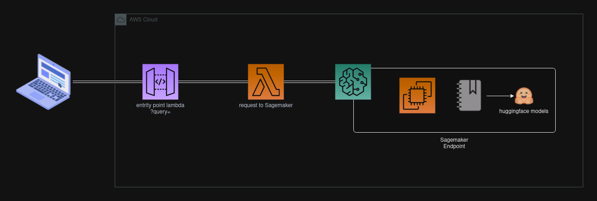

## Overview

## Basic architecture

Image example of the output like a pic.

## References

[SAGEMAKER ENDPOINT](https://docs.aws.amazon.com/sagemaker/latest/dg/serverless-endpoints-create.html)
[HF_TASK](https://github.com/huggingface/hub-docs/blob/main/tasks/src/const.ts)
[Philipp Schmid Blog](https://www.philschmid.de/)
