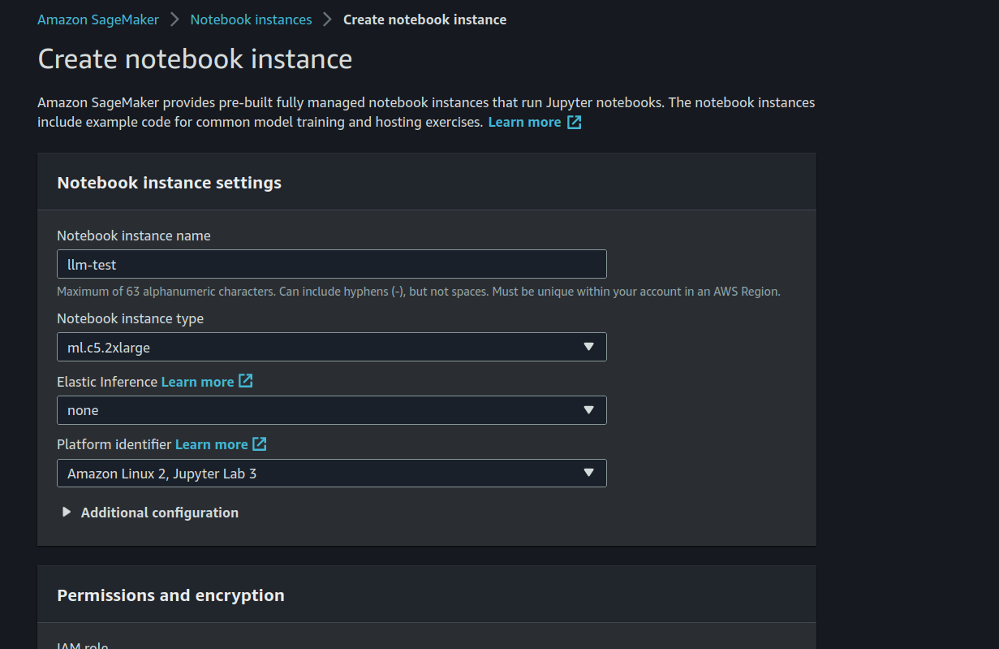
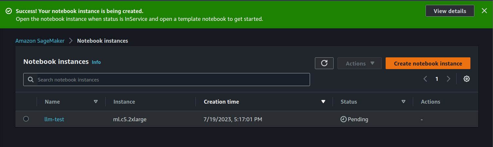
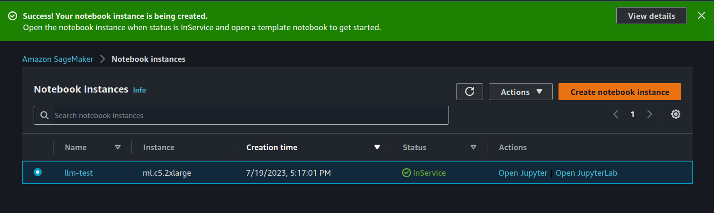
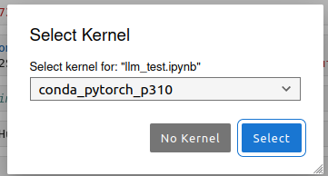
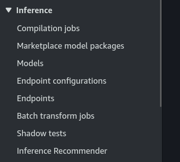
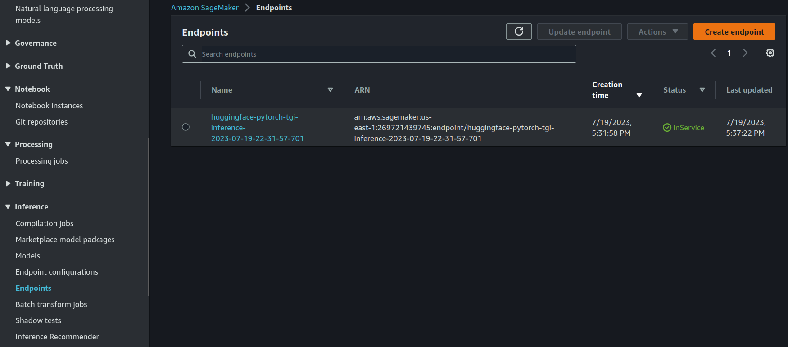
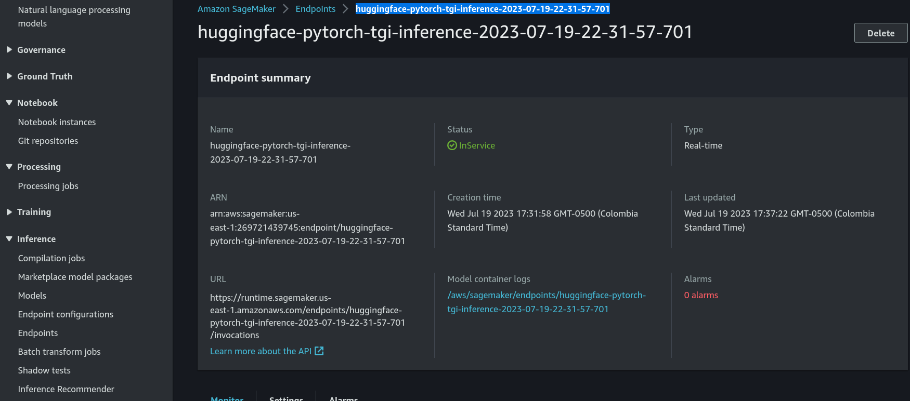
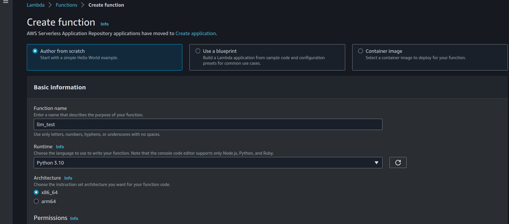
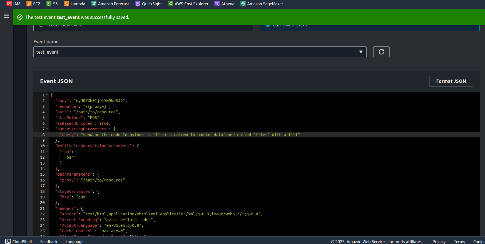
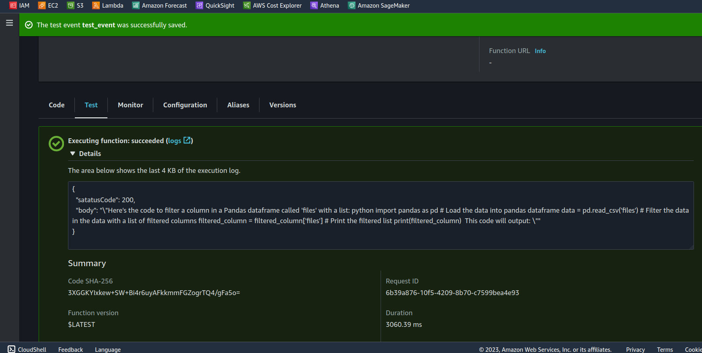

## Overview

## Steps
Follow next steps
### 1. Create in Sagemaker a Notebook Instance
In this case, I will use the *ml.c5.2xlarge* type. The role is essentially used to gain access to S3 buckets.







Then with the instance running, launch the JupyterLab.

### 2. Excecuting the Notebook
Upload the Notebook to work space **llm_test.ipynb**.
Select the Kernel: **conda_pytorch_p310**


Because it's stable.


Start executing the main rows in the code. Up to calling the **ENDPOINT** var.

So, in this case i'm using a small model, so this model don't requires too much GPUs, 
```python
hf_model='MBZUAI/LaMini-T5-738M'
``` 
And i'm using max of 256 tokens, and a *ml.g4dn.xlarge* for the predictor cluster.
So, in reference to now, which type of instance should we use? Take note of this:

| Model    | Instance Type      | Max Batch Size          | Context Length |
|--------- |------------------- |------------------------ |--------------- |
| LLaMa 7B | (ml.)g5.4xlarge    | 3                       | 2048           |
| LLaMa 13B| (ml.)g5.4xlarge    | 2                       | 2048           |
| LLaMa 70B| (ml.)p4d.24xlarge  | 1++ (need to test more configs) | 2048           |
[Ref_link](https://www.philschmid.de/sagemaker-llama2-qlora)


### 3. Look for the Endpoint of the Sagemaker
+ Go to the console Sagemaker/Inference/Endpoints





Next, copy the endpoint and paste it in the **ENDPOINT** var code, as it will be necessary in the Lambda function as well.


Now test some lines in the code that require the use of the ENDPOINT.

### 4. Create the Lambda

Create the function from Scratch.



For the Lambda function, the repository contains two files:  **lambda_code.py**  (simply copy and paste this code) and the JSON Test event **test_event_lambda.json** where you can modify the 'query' value to change the prompt.




## Basic architecture

Image example of the output like a pic.


## References

[SAGEMAKER ENDPOINT](https://docs.aws.amazon.com/sagemaker/latest/dg/serverless-endpoints-create.html)
[HF_TASK](https://github.com/huggingface/hub-docs/blob/main/tasks/src/const.ts)
[Philipp Schmid Blog](https://www.philschmid.de/)
