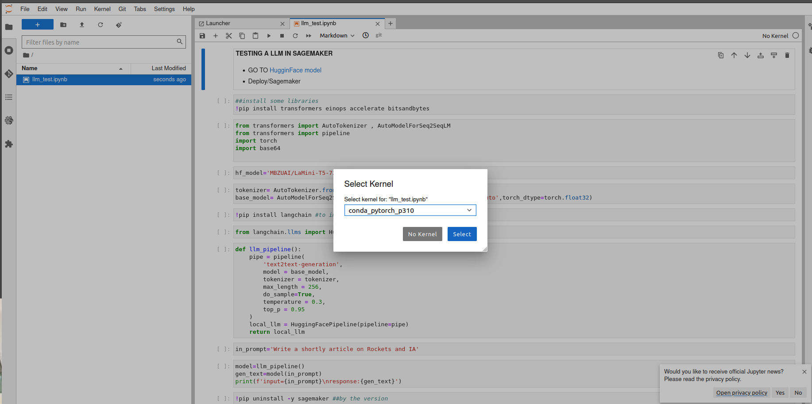

## Overview
This repository offers a concise guide for deploying a Language Model (LLM) on Amazon SageMaker and creating an API to interact with the deployed endpoint. Using SageMaker, the LLM is trained and hosted as an API endpoint, accepting text inputs and generating language-based predictions. The API, processes user requests, sends them to the SageMaker endpoint, and delivers responses back to users. The repository includes documentation and examples for easy setup and customization. With this powerful combination of LLM and API, various language-related applications, such as chatbots and sentiment analysis tools, become readily accessible.
## Steps
Follow next steps to create the next infraestructure:

**Basic architecture**
This is a basic architecture for this deployment that could ensure the data used in these kinds of applications.


## 1. Create in Sagemaker a Notebook Instance
In this case, I will use the *ml.c5.2xlarge* type. The role is essentially used to gain access to S3 buckets.


Then with the instance running, launch the JupyterLab.

## 2. Excecuting the Notebook
Upload the Notebook to work space **llm_test.ipynb**.
Select the Kernel: **conda_pytorch_p310**


Because it's stable.


Start executing the main rows in the code. Up to calling the **ENDPOINT** var.

So, in this case i'm using a small model, so this model don't requires too much GPUs, 
```python
hf_model='MBZUAI/LaMini-T5-738M'
``` 
I am currently using a maximum of 256 tokens, and for the predictor cluster, I am utilizing an *ml.g4dn.xlarge* instance.
But it's essentially the same concept, just on a larger scale to accommodate bigger models.

So, in reference to now, which type of instance should we use? Take note of this:

| Model    | Instance Type      | Max Batch Size          | Context Length |
|--------- |------------------- |------------------------ |--------------- |
| LLaMa 7B | (ml.)g5.4xlarge    | 3                       | 2048           |
| LLaMa 13B| (ml.)g5.4xlarge    | 2                       | 2048           |
| LLaMa 70B| (ml.)p4d.24xlarge  | 1++ (need to test more configs) | 2048           |

[Ref_link](https://www.philschmid.de/sagemaker-llama2-qlora)

## 3. Look for the Endpoint of the Sagemaker
+ Go to the console Sagemaker/Inference/Endpoints


Next, copy the endpoint and paste it in the **ENDPOINT** var code, as it will be necessary in the Lambda function as well.


Now test some lines in the code that require the use of the ENDPOINT.

## 4. Create the Lambda

Create the function from Scratch.


For the Lambda function, the repository contains two files:  **lambda_code.py**  (simply copy and paste this code) and the JSON Test event **test_event_lambda.json** where you can modify the 'query' value to change the prompt.


## References

[SAGEMAKER ENDPOINT](https://docs.aws.amazon.com/sagemaker/latest/dg/serverless-endpoints-create.html)

[HF_TASK](https://github.com/huggingface/hub-docs/blob/main/tasks/src/const.ts)

[Philipp Schmid Blog](https://www.philschmid.de/)


## Contributing

Thank you for your interest in contributing to the iMarckDEV Blog Repository. If you have any improvements or bug fixes, please feel free to submit a pull request. We appreciate your contributions!

## License

This project is licensed under the [MIT License](LICENSE). Feel free to use, modify, and distribute this code for personal or commercial purposes.

For more information, visit the [iMarckDEV blog site](https://www.imarck.dev) and explore other resources and tutorials. Happy coding!'''